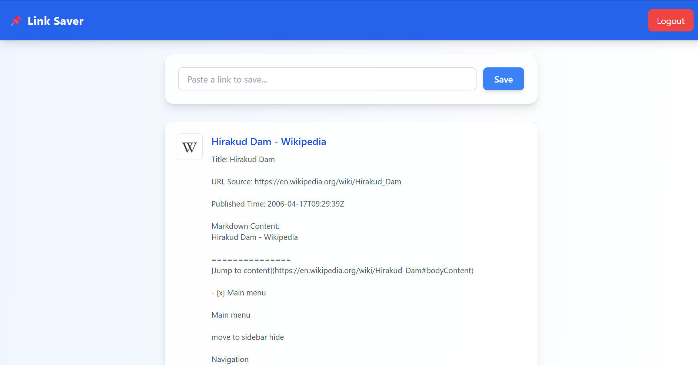

# 📌 Link Saver App

A full-stack web application to save, manage, and view your favorite links with AI-generated summaries.  
Built with **React** (frontend), **Node.js + Express** (backend), and **MongoDB Atlas** (database).

---

## 🚀 Features

- Save any link easily with a click.
- AI-powered link summarization (via [Jina AI](https://jina.ai/)).
- View all saved bookmarks in a clean, responsive dashboard.
- Secure authentication using JWT.
- Fully responsive UI with Tailwind CSS.

---

## 🛠 Tech Stack

### Frontend
- React.js
- Tailwind CSS

### Backend
- Node.js
- Express.js
- MongoDB Atlas
- Mongoose
- JWT Authentication

---
## 📸 Screenshot

---

### ✨ Author  
**Subhranta Nayak** – [GitHub](https://github.com/Subhranta703)  

> "Code is like humor. When you have to explain it, it’s bad — but when it works, it’s magic."

